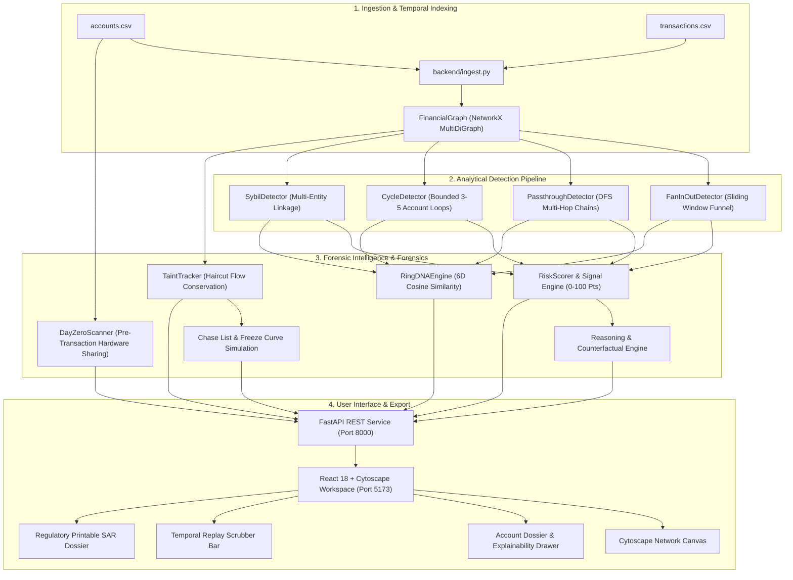

# MuleTrace 🔍🛡️

> **Autonomous Money-Mule & Layering Ring Detection System**  
> *Engineered for high-velocity AML investigations, explainable forensic intelligence, and real-time capital preservation.*

[](https://python.org)
[](https://fastapi.tiangolo.com)
[](https://react.dev)
[](https://vitejs.dev)
[](https://networkx.org)
[](https://opensource.org/licenses/MIT)

---

## 📑 Table of Contents
- [1. Project Overview](#1-project-overview)
- [2. Setup & Installation Instructions](#2-setup--installation-instructions)
- [3. Key Features](#3-key-features)
- [4. Technology Stack](#4-technology-stack)
- [5. Architecture & Workflow](#5-architecture--workflow)
- [6. Dataset & API Information](#6-dataset--api-information)
- [7. Screenshots & Demo Information](#7-screenshots--demo-information)
- [8. Limitations & Future Scope](#8-limitations--future-scope)
- [9. Team Members](#9-team-members)
- [10. Compliance & Ethical Disclaimers](#10-compliance--ethical-disclaimers)

---

## 1. Project Overview

Digital payment rails (such as UPI, IMPS, Pix, and SEPA Instant) process millions of transactions per minute with instant settlement. While revolutionary for commerce, this speed has been aggressively exploited by organized financial crime syndicates using **distributed money-mule networks**. Fraudulent proceeds are systematically dispersed across hundreds of intermediary accounts within seconds through multi-hop layering chains, fan-out disbursement funnels, circular wash loops, and synthetic identities (sybils).

**MuleTrace** is an autonomous, explainable graph analytics and forensic intelligence platform engineered to detect, visualize, and interdict money-mule rings in real time.

### Core Objectives & Value Proposition
- **High-Velocity Detection**: Identifies complex laundering topologies across thousands of transactions in sub-second latency.
- **100% Explainable Scoring**: Every flagged account includes transparent point-based threat accounting, forensic evidence, and **automated counterfactual explanations** detailing exact actions that clear the account.
- **Dynamic Capital Preservation**: Mathematically rigorous haircut taint propagation calculates capital recovery decay curves ($t = 0, 5, 10, 15, 30, 60$ minutes), generating prioritized interdiction lists (Chase Lists) to freeze funds before final off-ramp dissipation.
- **Privacy-Preserving & 100% Offline**: Zero external LLM or cloud dependencies. Runs entirely on local infrastructure with synthetic data isolation.

---

## 2. Setup & Installation Instructions

### Prerequisites
- **Python**: Version `3.10` or higher (tested on Python 3.10 – 3.14).
- **Node.js**: Version `18.x` or higher and `npm` (tested on Node v20/v24).
- **Git**: Latest version for version control.

---

### Quickstart (Single-Command Automated Launchers)

MuleTrace includes cross-platform launcher scripts that start the backend and frontend services concurrently:

- **Windows (PowerShell)**:
  ```powershell
  .\run.ps1
  ```
- **Windows (Command Prompt / Batch)**:
  ```cmd
  start.bat
  ```
- **macOS / Linux**:
  ```bash
  chmod +x run.sh
  ./run.sh
  ```

Once started, access the interfaces at:
- **Interactive Web Dashboard**: [http://localhost:5173](http://localhost:5173) (or `http://localhost:8000` when running production static build)
- **Interactive Swagger REST API Docs**: [http://localhost:8000/docs](http://localhost:8000/docs)

---

### Manual Step-by-Step Installation

#### Step 1: Clone Repository
```bash
git clone https://github.com/<your-username>/muletrace-5.git
cd muletrace-5
```

#### Step 2: Backend Setup
```bash
# 1. Create and activate a Python virtual environment
python -m venv .venv

# On Windows:
.venv\Scripts\activate
# On macOS / Linux:
source .venv/bin/activate

# 2. Install Python dependencies
pip install -r requirements.txt

# 3. Start the FastAPI backend server
uvicorn backend.api:app --host 127.0.0.1 --port 8000 --reload
```

#### Step 3: Frontend Setup
```bash
# 1. Open a new terminal and navigate to frontend directory
cd frontend

# 2. Install Node dependencies
npm install

# 3. Launch Vite development server
npm run dev

# (Optional) Build production static assets served directly by FastAPI
npm run build
```

---

### Verification & Testing Suite

Verify the system integrity and benchmark performance with the included test suites:

```bash
# Run all 27 unit & integration tests (pattern detectors, scoring, taint, APIs)
python -m pytest backend/tests/ -v

# Run high-performance benchmark suite
python backend/evaluation/bench.py
```

*Benchmark Performance (810 Accounts, 10,322 Transactions):*
- Ingestion & Graph Indexing: **2.63s** (Budget < 3.0s)
- 4-Detector Pattern Execution: **310ms** (Budget < 1.0s)
- Scoring & Counterfactuals: **102ms** (Budget < 1.0s)
- BFS 150-Node Subgraph Extraction: **0.11ms** (Budget < 300ms)
- Taint Propagation & Freeze Curve: **50.68ms** (Budget < 200ms)

---

## 3. Key Features

### 1. 4-Detector Analytical Engine
- **Fan-In / Fan-Out Funnels**: Detects rapid fund aggregation followed by split dispersion while strictly protecting legitimate merchant, e-commerce, and payroll aggregators.
- **Pass-Through Layering Chains**: Depth-First Search (DFS) tracking multi-hop relays ($\ge 3$ hops, $\le 8$ min inter-hop latency, $\ge 85\%$ forwarding drain ratio).
- **Circular Wash Loops**: Chronologically bounded cycle detection ($3 \le k \le 5$ accounts, duration $\le 45$ min) eliminating false-positive 2-party peer transfers.
- **Weighted Sybil Clusters**: Multi-attribute identity graph linkage across shared device IDs, MAC addresses, PAN hashes, phone numbers, and IP subnets.

### 2. 100% Explainable Threat Scoring & Counterfactuals
- **Zero Black Boxes**: Clear breakdown showing Base Pattern Points + Secondary Bonuses + Turnover Velocity - Dampeners.
- **Dual Signal Assurance**: Separate risk score ($0-100$) and empirical Confidence Rating (High, Medium, Low).
- **Automated Counterfactuals**: Provides exact mathematical guidance on behavioral shifts that would clear the account classification.
- **Innocent Victim Protection Invariant**: Distinguishes victims from collusive mules; victims are assigned a zero risk score and protected with calm-blue status.

### 3. Haircut Taint Tracking & Freeze Simulation
- **Proportional Haircut Conservation**: Tracks the flow of stolen capital across downstream transactions adhering to financial mass conservation laws.
- **Real-Time Capital Recovery Curve**: Simulates estimated funds saved at intervention intervals ($t = 0, 5, 10, 15, 30, 60$ minutes).
- **Actionable Chase List**: Generates a ranked interdiction queue with one-click clipboard export for banking fraud operations.

### 4. 6D Ring DNA & AML Typology Matching
- Normalized 6-dimensional vector fingerprinting (Network Density, Member Count, Total Duration, Avg Hop Latency, Balance Retention Ratio, Drain Rate).
- Cosine similarity matching against an AML typology knowledge base (ATM Dispersion, Crypto Off-Ramp Funnels, Circular Wash Rings, Layered Relays).
- Automatically composes executive 3-paragraph plain-language intelligence narratives.

### 5. Interactive Forensic Workspace & Scrubber
- **Interactive Cytoscape Canvas**: Custom geometric role shapes: **Hexagon** (Hub), **Rectangle** (Relay), **Diamond** (Exit/Cash-out), **Rhombus** (Victim), and **Circle** (Member).
- **Logarithmic Edge Weighting**: Transaction volume scales edge thickness; crimson traces highlight active tainted flows.
- **Temporal Flow Scrubber**: Interactive timeline bar with play, pause, frame step, and toggle close to replay money movements as they unfolded over time.
- **Regulatory SAR Generator**: One-click generation of printable, audit-compliant Suspicious Activity Report (SAR) dossiers.

### 6. Universal Command Palette & Accessibility
- `Ctrl + K`: Universal search across accounts, rings, typology presets, and actions.
- Keyboard navigation accelerators: `J` / `K` (Alert Queue), `Space` (Replay Play/Pause), `Esc` (Dismiss/Close), `?` (Keyboard Cheat Sheet).

---

## 4. Technology Stack

| Layer | Technologies | Purpose |
| :--- | :--- | :--- |
| **Frontend Framework** | React 18, Vite | High-performance reactive Single Page Application (SPA) |
| **State Management** | Zustand | Predictable, lightweight client-side state store |
| **Graph Visualization** | Cytoscape.js | High-performance canvas network rendering with layout engines |
| **Icons & Design** | Lucide React, Custom CSS Tokens | Modern cybersecurity aesthetic, dark purple palette, high contrast |
| **Backend REST API** | FastAPI, Uvicorn, Pydantic | Asynchronous Python REST backend with automatic OpenAPI schema |
| **Graph & Math Engine** | NetworkX, NumPy, SciPy | Temporal MultiDiGraph indexing, matrix eigendecomposition, optimization |
| **Config & Rules** | PyYAML | Externalized detection thresholds (`backend/config/thresholds.yaml`) |
| **Testing & Tooling** | Pytest, Playwright | Comprehensive unit, integration, and end-to-end browser tests |

---

## 5. Architecture & Workflow



### End-to-End Investigation Workflow
1. **Streaming / Batch Ingestion**: Chronological ingestion maps transactions into an in-memory indexed multigraph.
2. **Autonomous Scanning**: Detectors execute concurrently across sliding temporal windows.
3. **Forensic Scoring**: Composite threat scores and confidence ratings are calculated, while innocent victims are insulated.
4. **Interactive Investigation**: Investigators review prioritized alerts, inspect the graph, review counterfactual recommendations, and replay illicit transaction flow histories.
5. **Actionable Interdiction**: The system outputs an optimized interdiction sequence to freeze exit points and generates regulatory-ready SAR dossiers.

---

## 6. Dataset & API Information

### Synthetic Demonstration Dataset
To guarantee absolute compliance with data privacy standards and banking secrecy laws, MuleTrace operates strictly on synthetic, seed-reproducible demonstration data:
- **Location**: `data/demo/`
- **Volume**: **810 Accounts**, **10,322 Transactions**, across 4 syndicate ring typologies.
- **Generator**: `python data/make_data.py --seed 42`
- **Integrity Validator**: `python data/validate_dataset.py`

#### Data Schema Overview
- `accounts.csv`: `account_id`, `customer_name`, `account_type`, `created_at`, `pan_hash`, `device_id`, `ip_address`, `phone_hash`.
- `transactions.csv`: `txn_id`, `sender_id`, `receiver_id`, `amount`, `timestamp`, `payment_channel`.
- `ground_truth.csv`: Benchmark evaluation labels strictly isolated from detectors (`test_ground_truth_isolation.py`).

---

### Core REST API Endpoints

The FastAPI backend exposes fully documented endpoints (Swagger at `http://localhost:8000/docs`):

| Method | Endpoint | Description |
| :--- | :--- | :--- |
| `GET` | `/api/metrics` | High-level KPI summary (audited entities, flagged mules, rings, volume) |
| `GET` | `/api/accounts` | Query flagged accounts with filters (severity, ring, confidence) |
| `GET` | `/api/accounts/{id}` | Detailed account dossier (evidence, score breakdown, counterfactual) |
| `GET` | `/api/rings` | List detected mule syndicates with 6D Ring DNA and typology matching |
| `GET` | `/api/rings/{id}` | Full syndicate details, member roles, and executive narrative |
| `GET` | `/api/graph` | Subgraph extraction for Cytoscape.js with BFS 150-node safety cap |
| `POST`| `/api/replay` | Fetch chronological transaction frames for temporal replay scrubber |
| `POST`| `/api/freeze` | Run what-if freeze simulation and generate capital recovery decay curve |
| `GET` | `/api/sar/{id}` | Generate formal printable Suspicious Activity Report (SAR) |
| `GET` | `/api/evasion-test` | Ground truth evaluation metrics (Precision, Recall, F1) |

---

## 7. Screenshots & Demo Information

### Visual Interface Showcase

| Screen | Description |
| :---: | :--- |
| **Investigation Workspace** | Central command view featuring interactive Cytoscape network canvas, priority Alert Queue, and compact real-time KPI dock. |
| **Account Dossier** | Comprehensive forensic drawer showing risk breakdown, confidence metrics, rule satisfaction bars, and automated counterfactual text. |
| **Temporal Flow Scrubber** | Elevated timeline control bar allowing frame-by-frame temporal replay of pass-through transactions with play/pause and click-to-close toggle. |
| **Simulate Freeze Dialog** | What-if simulation modal providing instant capital recovery projections and prioritized account interdiction. |
| **Regulatory SAR Dossier** | Audit-ready Suspicious Activity Report with timestamped evidence for compliance filing. |

*(Screenshots can be added to your repository's `/docs/screenshots` directory.)*

### Presentation & Pitch Resources
- **Stage Presentation Script**: [`docs/demo_script.md`](docs/demo_script.md) (Complete timed script including live stage prompts).
- **Pitch Deck Outline**: [`docs/pitch.md`](docs/pitch.md) (Slide-by-slide structure, market problem, and competitive edge).
- **Forensic Methodology**: [`HOW_IT_WORKS.md`](HOW_IT_WORKS.md) (Mathematical formulas and algorithmic derivations).
- **Technical Q&A**: [`docs/qa.md`](docs/qa.md) (Anticipated evaluation questions and responses).

---

## 8. Limitations & Future Scope

### Current Limitations
1. **In-Memory Graph Scope**: Currently optimized for single-machine in-memory execution using NetworkX (up to ~100k nodes and transactions with sub-second performance).
2. **Synthetic Data Calibration**: Default detection thresholds are calibrated against synthetic banking topologies and require domain-specific tuning for live core banking systems.
3. **Local Standalone Architecture**: Built for offline security environments without integrated distributed database synchronization.

### Future Roadmap & Scope
- [ ] **Distributed Graph Ingestion**: Scale to billions of daily transactions via Apache Spark GraphX or GPU-accelerated cuGraph.
- [ ] **Streaming Event Bus Integration**: Native Apache Kafka / AWS Kinesis connectors for microsecond event stream interception.
- [ ] **Cross-Institutional Ring Sharing**: Privacy-preserving federated learning and cryptographic homomorphic encryption to detect inter-bank mule rings across institutions without sharing raw PII.
- [ ] **Mobile Biometric Telemetry**: Incorporate behavioral biometrics (gyroscope angle, typing cadence, screen pressure) to detect forced account handover.

---

## 9. Team Members

| Name | Role | Responsibilities | GitHub / Contact |
| :--- | :--- | :--- | :--- |
| **Swayam** | Project Lead & Full Stack Architect | System Architecture, Frontend UI/UX, Graph Engineering & Integration | [@Swayam](https://github.com/) |
| *(Contributor Name)* | Backend / Algorithm Engineer | Analytical Detectors, Taint Propagation, Scoring Logic | |
| *(Contributor Name)* | Data & ML Specialist | Dataset Synthesis, Verification Benchmarks, Active Learning Loop | |
| *(Contributor Name)* | Security & Compliance Analyst | AML Typologies, SAR Generation, Regulatory Standards | |

---

## 10. Compliance & Ethical Disclaimers

- **Synthetic Data Guarantee**: All personal names, account identifiers, PAN hashes, device IDs, and transaction histories in this repository are purely synthetic and generated via pseudorandom algorithms (`seed=42`). No real banking or personally identifiable information (PII) is present.
- **Educational & Prototype Use**: MuleTrace is designed as a software demonstration and research platform for evaluating algorithmic anti-money laundering techniques.
- **Estimated Calculations**: All "Amount Saved" and "Capital Preserved" figures are simulated estimates derived from taint decay heuristics under test parameters.

---

<div align="center">
  <sub>Engineered with precision for advanced financial security and anti-money laundering investigations.</sub>
</div>
