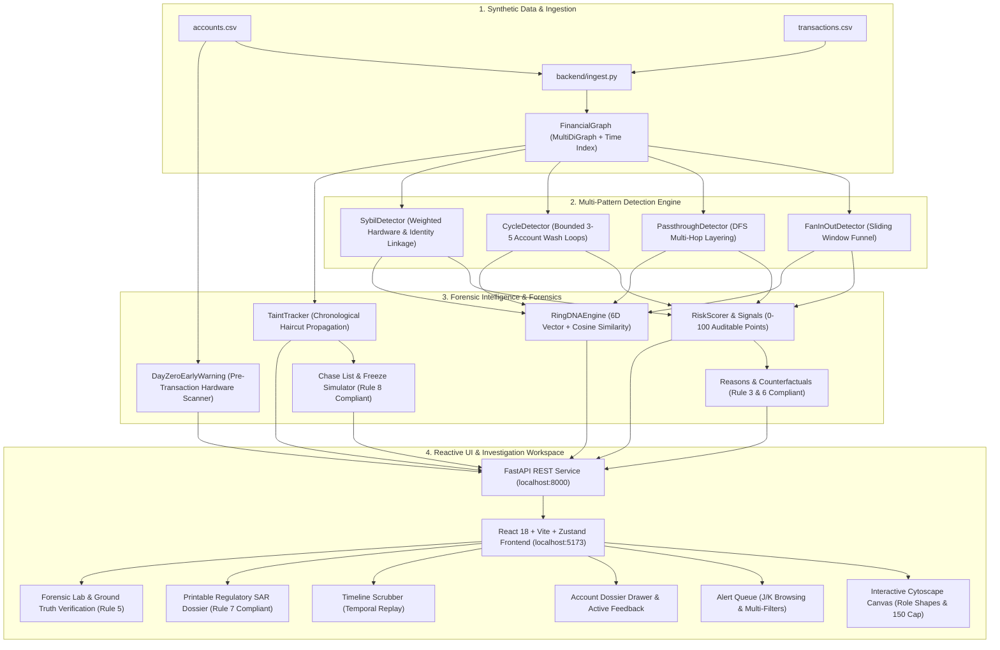

# MuleTrace

> **Autonomous Money-Mule & Layering Ring Detection System**  
> *Engineered for high-velocity AML investigations, explainable forensic intelligence, and real-time capital preservation.*

---

## Architecture Overview



---

## Key Features

1. **4 Analytical Pattern Detectors**:
   - **Fan-In / Fan-Out Hubs**: Catches high-velocity collection and dispersal while protecting legitimate merchants and payroll.
   - **Pass-Through Layering Chains**: DFS algorithm identifying multi-hop relays ($\ge 3$ hops, $\le 8$m gap, $\ge 85\%$ forward ratio).
   - **Circular Wash Loops**: Bounded chronological cycle detection ($3 \le k \le 5$, duration $\le 45$m) eliminating 2-party friend split false positives.
   - **Weighted Sybil Clusters**: Multi-attribute linkage (device, PAN hash, phone, IP) with safeguards against campus Wi-Fi and family tablets.

2. **100% Explainable Threat Scoring & Counterfactuals**:
   - Transparent point accounting: Base Points + Secondary Pattern Bonuses + Velocity Bonuses - Dampeners.
   - Separate Confidence Meter (High, Medium, Low) based on empirical corroboration.
   - Automated Counterfactuals (Rule 3): Explicitly tells analysts what behavioral change clears the account.
   - Innocent Victim Protection: Victims receive 0 risk score and protective calm-blue classification.

3. **Haircut Taint Tracing & Real-Time Freeze Simulation**:
   - Chronological proportional haircut taint propagation maintaining mathematical conservation laws.
   - Capital Recovery Decay Curve ($t = 0, 5, 10, 15, 30, 60$ minutes) proving money saved by early intervention.
   - Prioritized Interdiction Queue (Chase List) with one-click clipboard copying for bank fraud operations.

4. **6D Ring DNA & AML Typology Matching**:
   - Extracts a normalized 6-dimensional fingerprint vector representing structure, size, duration, hop gap, retention, and drain rate.
   - Cosine similarity matching against an AML typology library (Crypto Funnels, ATM Chains, Wash Rings, Synthetic Clusters).
   - Generates an executive 3-paragraph plain-language narrative.

5. **Gated Active Learning & Day-Zero Early Warnings**:
   - Human analyst decisions (`confirmed_mule` / `cleared_benign`) feed a regularized model gated behind $\ge 10$ labels.
   - Pre-transaction scanner flags newly opened account clusters sharing emulator devices before funds move.

6. **Interactive Cytoscape.js Workspace**:
   - Geometric role shapes: **Hexagon** (Hub), **Rectangle** (Relay), **Diamond** (Exit), **Rhombus** (Victim), **Ellipse** (Member).
   - Edge thickness scaled logarithmically by transfer amount, with red lines indicating tainted flow.
   - Strict 150-node safety cap for guaranteed 60fps responsiveness.

7. **Universal Command Palette & Keyboard Accessibility**:
   - `Ctrl+K`: Universal search across accounts, syndicates, presets, and actions.
   - Single-key accelerators: `J`/`K` (Alert Queue), `1`/`2`/`3` (Presets), `P` (Presenter Mode), `T` (Themes), `Space` (Replay), `Esc` (Close), `?` (Cheat Sheet).
   - 4 native themes: Dark Cyber-Defense, Calm Slate, Paper Light, and High-Contrast Colorblind.

---

## 10 Core Invariants & Tenets

| Tenet | Rule Description | Enforcement in MuleTrace |
| :--- | :--- | :--- |
| **Rule 1** | **Synthetic Data Only** | Zero real PII; synthetic KYC hashes; reproducible seed generation. |
| **Rule 2** | **No Hidden Magic** | Zero hardcoded detection thresholds; all configured in `backend/config/thresholds.yaml`. |
| **Rule 3** | **Explainability First** | Every score includes score, band, confidence, breakdown, reason, and counterfactual. |
| **Rule 4** | **Never Invent Results** | Zero uncomputed metrics; every chart and KPI is strictly derived from live data. |
| **Rule 5** | **Ground Truth Isolation** | `ground_truth.csv` is strictly isolated for evaluation; detectors never access it. |
| **Rule 6** | **Analyst Language** | Non-technical explanations use banking terms (*account, transfer, connected account, path*) — never graph jargon. |
| **Rule 7** | **Synthetic Disclaimer** | Every export, SAR dossier, and report bears: *"Synthetic demonstration data. Not a real case."* |
| **Rule 8** | **Saved Money Disclaimer** | Every freeze calculation displays: *"Estimated amount saved: ₹X"*. |
| **Rule 9** | **Never Weaken Tests** | No disabling tests; threshold changes documented in `DECISIONS.md`. |
| **Rule 10** | **Zero External Dependencies**| Runs 100% offline on localhost; zero external cloud or LLM dependencies. |

---

## Quickstart & Installation

### Prerequisites
- Python 3.10+ (tested on Python 3.14)
- Node.js 18+ and npm (tested on Node v24)

### Automated Launchers
Start both backend and frontend concurrently with a single command:

- **Windows (PowerShell)**:
  ```powershell
  .\run.ps1
  ```
- **Windows (Command Prompt / Batch)**:
  ```cmd
  start.bat
  ```
- **macOS / Linux**:
  ```bash
  chmod +x run.sh
  ./run.sh
  ```

### Manual Setup

1. **Backend Setup**:
   ```bash
   # From project root
   python -m venv .venv
   # Windows: .venv\Scripts\activate | macOS/Linux: source .venv/bin/activate
   pip install -r requirements.txt
   uvicorn backend.api:app --host 127.0.0.1 --port 8000 --reload
   ```

2. **Frontend Setup**:
   ```bash
   cd frontend
   npm install
   npm run dev
   ```

The application will be live at:
- **Frontend UI**: [http://localhost:5173](http://localhost:5173)
- **Backend API Docs**: [http://localhost:8000/docs](http://localhost:8000/docs)

---

## Verification & Testing

### Complete Unit & Integration Test Suite
Execute all 27 backend tests verifying scaffolding, dataset generation, validation, pattern detection, scoring, taint tracing, APIs, and ground truth isolation:
```bash
python -m pytest backend/tests/ -v
```

### High-Performance Benchmark Suite
Verify real-time execution speeds against sub-second performance budgets:
```bash
python backend/evaluation/bench.py
```

*Benchmark Results (810 Accounts, 10,322 Transactions):*
- Ingestion & Graph Construction: **2.63s** (budget < 3.0s)
- 4-Detector Pipeline Execution: **310ms** (budget < 1.0s)
- Behavioral Signals & Scoring: **102ms** (budget < 1.0s)
- 150-Node Subgraph BFS Extraction: **0.11ms** (budget < 300ms)
- Taint Propagation & Freeze Curve: **50.68ms** (budget < 200ms)

---

## Project Structure

```
muletrace/
├── backend/
│   ├── config/
│   │   └── thresholds.yaml         # Presets (relaxed, balanced, strict) & scoring points
│   ├── detectors/
│   │   ├── fan_in_out.py           # Sliding-window funnel detector
│   │   ├── passthrough.py          # DFS multi-hop layering chain detector
│   │   ├── cycles.py               # Bounded 3-5 account wash cycle detector
│   │   └── sybil.py                # Multi-attribute identity linkage detector
│   ├── evaluation/
│   │   └── bench.py                # Performance benchmark runner
│   ├── tests/                      # 27 comprehensive pytest test suites
│   ├── api.py                      # FastAPI REST endpoints
│   ├── chase.py                    # Chase List & Freeze Curve simulation
│   ├── fraud_engine.py             # Analytical orchestrator
│   ├── graph.py                    # Indexed FinancialGraph NetworkX multigraph
│   ├── ingest.py                   # CSV loader and account summaries
│   ├── learning.py                 # Active learning loop & Day-Zero warnings
│   ├── quantum/                    # MuleTrace Ω: Quantum-inspired simulation layer
│   │   ├── qwalk.py                # Continuous-Time Quantum Walk & Classical Laplacian
│   │   ├── interdiction.py         # QUBO simulated annealing network interdiction
│   │   └── ringstate.py            # Ring DNA quantum state fidelity
│   ├── reasons.py                  # Plain-language justifications & counterfactuals
│   ├── ringdna.py                  # 6D Ring DNA vector & typology matcher
│   ├── scoring.py                  # Explainable composite threat scoring
│   ├── signals.py                  # Velocity and turnover feature extraction
│   └── store.py                    # In-memory session state & SAR generator
├── data/
│   ├── demo/                       # Synthetic demonstration dataset (810 accs, 10k txns)
│   ├── make_data.py                # Reproducible synthetic generator (--seed 42)
│   └── validate_dataset.py         # Schema, integrity, and temporal validator
├── frontend/
│   ├── src/
│   │   ├── components/             # AlertQueue, GraphCanvas, InspectorDrawer, etc.
│   │   ├── screens/                # RingsScreen, LabScreen, OmegaScreen
│   │   ├── store/                  # useMuleStore.js (Zustand state store)
│   │   ├── styles/                 # tokens.css (4 themes & design tokens)
│   │   ├── App.jsx                 # Screen router, keyboard handlers
│   │   └── main.jsx                # React DOM entrypoint
│   ├── package.json
│   └── vite.config.js
├── docs/
│   ├── demo_script.md              # Stage pitch presentation script (with 90s Ω segment)
│   ├── pitch.md                    # Slide-by-slide deck & problem statement
│   └── qa.md                       # Anticipated judge questions & technical answers
├── DECISIONS.md                    # Complete chronological architectural decisions log
├── HOW_IT_WORKS.md                 # Detailed forensic methodology & formulas
├── SPEC.md                         # Complete project specification
├── requirements.txt
├── run.ps1                         # PowerShell launch script
├── start.bat                       # Windows batch launch script
└── run.sh                          # Bash launch script
```

---

## MuleTrace Ω (Omega): Quantum-Inspired Simulation Layer

> **Honesty Mandate**: *Simulated on a classical computer. Synthetic demonstration data. Not a real case.*  
> No hardware quantum speedup is claimed. All metrics are computed live from data.

MuleTrace Ω is an exploratory physics-inspired analytical module designed for advanced AML research:
1. **Continuous-Time Quantum Walk (CTQW)**:
   - Evaluates probability amplitude propagation $U(t) = V \exp(-i \Lambda t) V^\dagger$ on the ring's symmetric weighted adjacency matrix ($w_{ij} = \log(1 + \text{amount})$).
   - Solved via exact Hermitian eigendecomposition (`numpy.linalg.eigh`).
   - Directly benchmarked against classical heat diffusion $p(t) = \exp(-L t) p_0$ with graph Laplacian $L = D - A$. Both methods strictly conserve total probability mass ($1.0 \pm 10^{-9}$).
   - Predicts top-5 exit cash-out accounts and measures overlap with real exits from taint tracking.
2. **QUBO Network Interdiction**:
   - Formulates proactive account freezing as binary quadratic optimization:
     $$\min_{x} \lambda_1 \sum (1 - x_i) \text{flow}_i + \lambda_2 \sum x_i \text{innocence}_i + \mu \left(\sum x_i - K\right)^2$$
   - Solved with deterministic simulated annealing (`seed = 42`).
   - Strictly enforces the **Victim Protection Invariant** ($x_{\text{victim}} \equiv 0$).
   - Compares estimated funds saved and false-positive collateral against the greedy Chase List.
3. **Ring DNA Quantum State Fidelity**:
   - Computes pure state transition fidelity $F(|a\rangle, |b\rangle) = |\langle a | b \rangle|^2$ across detected rings and AML typologies.
   - For normalized non-negative real feature vectors, state fidelity is mathematically identical to $(\cos \theta)^2$.
4. **Calm, Back-of-the-Room Stepper UI**:
   - Accessible 4-step progressive disclosure interface with Cytoscape dual visualization, shared time slider, budget controls, and fidelity heat matrix.
   - Full support for all 4 themes (including High-Contrast Colorblind) and Presenter Mode (`P` key).

---

## Compliance & Legal Disclaimer

*MuleTrace is a synthetic software demonstration platform developed for educational and academic evaluation. All personal names, account identifiers, PAN hashes, device IDs, and transfer histories are purely synthetic and generated via reproducible pseudorandom algorithms. Not a real banking case. All freeze estimations carry Rule 8 compliance disclaimers.*

